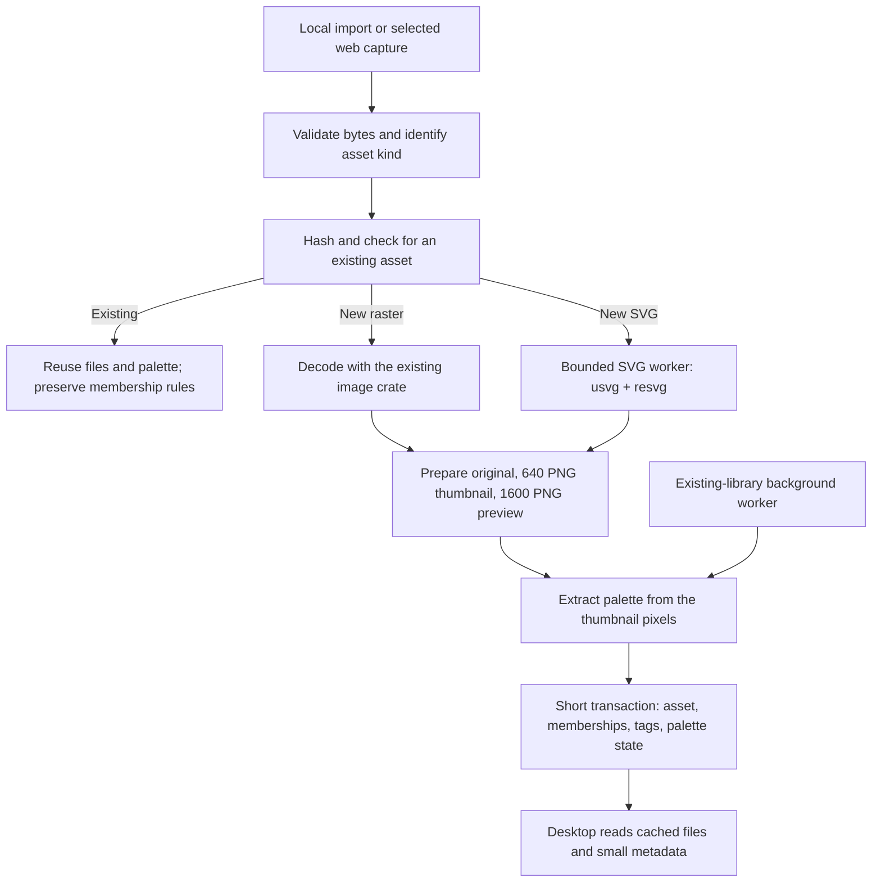

# Fragment v0.0.8 — Color Palette and SVG Support

Execution status: feature implementation and local packaging are complete. The remaining native UI/performance and real Chrome gates are tracked in [V0.0.8_QA.md](V0.0.8_QA.md); the release definition of DONE below is not yet satisfied.

Branch: `vbeta0.0.8`, created from local `main` at `cec0cab8211842e26f9f03df78867910a8f3e7b5` (the vbeta0.0.7 merge). Package versions are now 0.0.8. This plan does not authorize remote publication or replacement of the user's installed app/Vault.

## Intended result

A user can import a static SVG or capture a selected web SVG image, browse it alongside photographs without repeatedly rendering vectors, open a sharp preview, and keep the original vector file. Every supported image can have a reusable local palette. A user can copy a palette color and find Fragments with a similar dominant color across the complete selected scope, including results beyond the loaded page.

The update is DONE only after the asset pipeline, existing-library upgrade, desktop controls, real Chrome/native capture, persistence, and packaged-app checks below pass. A screenshot, frontend build, or synthetic benchmark alone does not establish DONE.

## 1. Current code and consequences

Reviewed the production paths across the core, desktop, extension, shared contracts, migrations, cleanup, tests, benchmark scripts, and release tooling. The knowledge graph reports an index but returns empty symbol results; direct source inspection was used after graph discovery and tracing failed. Source anchors below refer to the starting commit.

| Existing behavior                                                                                                           | Source                                                                                            | Consequence for .8                                                                                                                                   |
| --------------------------------------------------------------------------------------------------------------------------- | ------------------------------------------------------------------------------------------------- | ---------------------------------------------------------------------------------------------------------------------------------------------------- |
| Local import guesses `image::ImageFormat` in both import entry points; captures do the same after downloading.              | `crates/fragment-core/src/fragments.rs:1122`, `:1159`; `capture.rs:108`                           | SVG needs a shared asset-format abstraction. Adding a file-picker extension alone cannot work.                                                       |
| `NewFragmentAsset.format` is `ImageFormat`; decoding assumes `DynamicImage`.                                                | `fragments.rs:39`, `:1239`; `thumbnails.rs:19`                                                    | Introduce a raster/SVG preparation boundary while keeping one persistence path.                                                                      |
| Assets own bytes and derivatives; Fragments are Frame memberships. SHA-256 is unique.                                       | `migrations/0001_init.sql:13`; `fragments.rs:1239`                                                | Palette and preview-cache ownership must be by asset, not Fragment membership.                                                                       |
| Bytes are decoded before the duplicate lookup.                                                                              | `fragments.rs:1252`                                                                               | Check an existing hash before expensive decoding/rendering; still recheck under the write transaction for races.                                     |
| Derivatives are a 640-edge PNG thumbnail and 1600-edge PNG preview.                                                         | `thumbnails.rs:10`                                                                                | Reuse these sizes and file paths for initial SVG support. SVG palettes can use the same rendered thumbnail pixels.                                   |
| File preparation runs outside the database transaction; successful staging is cleaned up after transaction failures.        | `fragments.rs:1239`, `:1463`                                                                      | Preserve short transactions and extend cleanup to failures halfway through SVG/file preparation.                                                     |
| Page items, totals, and selection IDs share `build_filtered_scope`.                                                         | `fragments.rs:167`, `:528`, `:686`                                                                | Add the color predicate once, before pagination, so selection and totals agree.                                                                      |
| Schema version is 4; older binaries refuse newer schemas.                                                                   | `db.rs:17`, `:89`                                                                                 | Add migration 0005; upgrade the desktop and bundled host together. Downgrading the migrated Vault to .7 is unsupported.                              |
| The v4 migration writes `CURRENT_SCHEMA_VERSION`.                                                                           | `db.rs:123`                                                                                       | Make each migration write its own version before adding v5; do not accidentally mark a partially migrated database as current.                       |
| Asset/Fragment/Frame mutations bump one library revision.                                                                   | `migrations/0003_library_revision.sql`                                                            | Track palette-only completion separately so backfill does not force a full library reload for every asset.                                           |
| Imports use two threads per batch, at most 500 items; multiple command invocations are not globally bounded.                | `apps/desktop/src-tauri/src/commands.rs:26`, `:547`                                               | Add shared processing admission limits rather than multiplying worker pools per job.                                                                 |
| Active views use `v7/FrameGallery`, `v7/FramesPage`, and `v7/FocusedFrameOverlay`.                                          | `apps/desktop/src/App.tsx:117`, `:3373`, `:3688`                                                  | Implement in these live views. Older `FragmentDetailSheet`, `FragmentQuickPreview`, `FilterPanel`, and `MasonryGrid` are not the primary UI targets. |
| Gallery source order is thumbnail → preview → original; detail order is preview → thumbnail → original.                     | `App.tsx:1860`                                                                                    | SVG originals must be excluded from both fallback chains. Request a new PNG when necessary.                                                          |
| Image fallbacks can be cached indefinitely as base64 in React state.                                                        | `App.tsx:1868`; `commands.rs:979`                                                                 | High-resolution SVG previews must use file URLs, with bounded cache ownership and eviction.                                                          |
| Focus refresh compares the library revision; there is no general live palette subscription.                                 | `App.tsx:923`                                                                                     | Add targeted palette notifications and a focus reconciliation path.                                                                                  |
| Live format controls currently list PNG/JPEG/WebP/GIF.                                                                      | `v7/FramesPage.tsx:41`                                                                            | Add SVG here, plus a Color control using the same popover styling.                                                                                   |
| Native Copy Image reads and raster-decodes the original synchronously.                                                      | `commands.rs:916`                                                                                 | Copy Image needs an SVG PNG path and must keep expensive work off the UI thread.                                                                     |
| Capture transport times out after 8 seconds; the core HTTP client allows 20 seconds per request and retries candidate URLs. | `apps/extension/src/background/native-client.ts:9`; `db.rs:50`; `capture.rs:108`                  | Align capture budgets and serialize dispatch to the sequential native host. Do not simply add rendering behind the current timeout.                  |
| Extension/core direct-image URL lists exclude SVG. SVG data URLs are explicitly rejected.                                   | `apps/extension/src/content/image-detector.ts:7`, `:97`; `capture.rs:312`                         | Add selected HTTP(S) SVG support in both lists; retain the separate boundary for inline/data/blob capture.                                           |
| Packager already includes `fragment-host`; protocol version is 2.                                                           | `scripts/build-local-release.mjs`; `src-tauri/tauri.conf.json`; `fragment-host/src/handlers.rs:5` | A private render-worker mode can reuse the shipped binary. URL-based SVG capture does not require a new Chrome message shape.                        |
| Existing Vault benchmark measures generated JavaScript metadata, not Rust, SQLite, image rendering, or native scrolling.    | `scripts/benchmark-vault-metadata.mjs`                                                            | Add measurements at those actual layers before making speed claims.                                                                                  |

## 2. Scope and behavior decisions

| Included in .8                                                                                                  | Explicit boundary                                                                                                                                                                                             |
| --------------------------------------------------------------------------------------------------------------- | ------------------------------------------------------------------------------------------------------------------------------------------------------------------------------------------------------------- |
| Palette extraction for the currently decoded raster formats and newly supported SVGs.                           | Animated raster palettes describe the cached first/static frame, not every animation frame.                                                                                                                   |
| Up to six dominant swatches, HEX copy, one-color similarity filtering.                                          | No AI, cloud service, palette editing, whole-palette similarity, or new color-export formats.                                                                                                                 |
| Automatic processing of existing assets while the desktop runs.                                                 | No launch-blocking full-library scan and no new always-running service.                                                                                                                                       |
| UTF-8 static `.svg` local import, drag/drop, and HTTP(S) image candidates already supported by Capture Mode.    | No `.svgz`, inline `<svg>` DOM serialization, standalone SVG-document capture, data/blob capture, or bulk icon extraction in this release.                                                                    |
| Paths, fills, strokes, gradients, masks, clipping, supported filters, text, and bounded embedded raster images. | Script, animation, `foreignObject`, DTD/entity declarations, external linked images/styles/fonts, and unsupported render features have explicit errors; they are not silently presented as faithful previews. |
| Fit/100%/200%/400% SVG preview with pan and sharper cached render tiers.                                        | This is a reference viewer, not a vector editor. Maximum render resolution is finite.                                                                                                                         |
| Original SVG retained and revealable; Copy Image copies a PNG rendering.                                        | Copy Image does not claim to put vector markup on the clipboard.                                                                                                                                              |

New controls use Frame/Fragment/Vault/Source vocabulary. Preserve the current .7 layout, typography, spacing, selection, Capture Mode, and keyboard behavior. Existing terminology inconsistencies are not a reason to redesign unrelated pages.

## 3. Shared pipeline

Rendering and color computation belong in `fragment-core`. Tauri owns app-lifetime scheduling and UI notifications. The native host owns the Chrome protocol and calls the same core. React displays results; it does not decode every original or calculate palettes while scrolling.

### Palette contract

1. Analyze an aspect-preserving sample with a maximum edge of 256 pixels from the canonical 640 PNG thumbnail. New imports reuse the in-memory thumbnail; backfill reads that PNG. This avoids decoding a large original again and keeps new/old extraction consistent.
2. Use straight-alpha sRGB pixels. Ignore alpha-zero pixels; weight other pixels by alpha. Do not composite a checkerboard, white, black, or the app theme into the palette. Correctly unpremultiply `tiny-skia` pixels before converting SVG output to straight RGBA.
3. Build a bounded 5-bit-per-channel histogram retaining weighted original RGB sums. Convert occupied-bin representatives into Oklab with the Rust `palette` crate.
4. Use deterministic weighted clustering: up to six centers, most-populated first center, deterministic farthest weighted seeds, maximum 12 iterations, stable tie-breaking. Merge centers closer than 0.025 Oklab distance. Reassign weights after merging. No random palette changes on restart.
5. Store 1–6 colors sorted by coverage; a single-color asset has one swatch. Fully transparent output is `empty`, not `failed`. Each color contains sRGB bytes, HEX derived from those bytes, Oklab coordinates, and fractional coverage. Coordinates used for matching must describe the final displayed sRGB swatch after gamut conversion.
6. Extraction failure produces a persisted retryable palette state; an otherwise valid image save succeeds. Database/storage failure still fails the save normally.
7. Palette interpretation is the app's cached preview in sRGB. Professional ICC/Display-P3 color management and exact original-file color fidelity are not claimed by this release.

The numerical constants above are proposed version-1 algorithm settings, not measured quality claims. T1 fixes the corpus and quality expectations; any tuning changes the documented settings before implementation is accepted.

### Storage contract — migration 0005

Add `0005_asset_colors_and_svg.sql` and explicit migration sequencing in `db.rs`.

| Storage                           | Required fields and rules                                                                                                                                                                                                                                       |
| --------------------------------- | --------------------------------------------------------------------------------------------------------------------------------------------------------------------------------------------------------------------------------------------------------------- |
| `asset_palettes`                  | `asset_id` primary key/FK → assets, algorithm version, source SHA-256, status (`pending`, `processing`, `ready`, `empty`, `failed`), attempt count, error code, next retry time, worker lease token/expiry, updated time. Missing row means pending.            |
| `asset_palette_colors`            | Asset FK, rank 0–5, RGB bytes, Oklab L/a/b, coverage; primary key `(asset_id, rank)`; coverage/RGB/rank constraints. Colors are replaced together with their status in one transaction.                                                                         |
| `asset_preview_cache`             | Asset FK, renderer/policy/font fingerprint, size tier, relative PNG path, byte size, last access; unique asset/fingerprint/tier. Only optional high-resolution renders live here; existing thumbnail/preview columns remain authoritative for base derivatives. |
| SVG render diagnostics            | Add nullable `assets.render_warnings_json` for typed warnings such as font substitution. Expose through a media-info read, not unrestricted arbitrary JSON from the extension.                                                                                  |
| `vault_metadata.palette_revision` | Monotonic completion revision, changed once per published palette result, separately from the normal library revision. Claims/retries alone do not refresh the gallery.                                                                                         |

Palette/cache rows cascade when the last asset is deleted. Optional PNG cache files must enter the existing pending-file-deletion queue before their rows disappear. Trashing one membership must not remove shared colors/files. Rendering that finishes after asset deletion must discard its outputs and never recreate the asset.

Migration changes schema only. It must not decode images. Use a consistent SQLite backup plus originals when testing rollback; copying only a live WAL database file is not a valid backup. The .7 binary rejects schema 5, so rollback means restoring a pre-upgrade backup, not pointing .7 at the upgraded Vault.

### SVG preparation and limits

Introduce `AssetFormat::Raster(ImageFormat) | Svg` and a prepared-asset result carrying bytes, MIME/extension, nominal dimensions, derivative paths, palette outcome, and render warnings. Both imports and web capture use this boundary.

Use file signatures and bounded XML validation rather than trusting extensions or HTTP MIME alone. Unknown/raster-unrecognized inputs may enter the bounded SVG probe. A renamed or extensionless valid SVG can work; an HTML error response named `.svg` cannot. Keep the original bytes and their SHA-256 unchanged.

Use `usvg`/`resvg` with matching versions, pinned through Cargo.lock after the spike. `usvg` 0.48.1 and `palette` 0.7.7 were visible in the reviewed documentation; those observations are dependency candidates, not proof they compile with this workspace. Use `resvg`'s compatible reexports where practical.

Run SVG parsing/rendering in a private `fragment-host --render-svg` child mode, selected before native-host database initialization. This reuses the already packaged executable. The parent supplies only internally generated staging paths and validated size options; the child never opens the Vault database. Keep the private request/result contract separate from Chrome's 1 MiB protocol. Worker stdout contains only its bounded result, never logs.

Why a process: moving work to `spawn_blocking` avoids the UI thread but does not make a running parser/render cancelable. A child can be killed/reaped on timeout or cancellation. This is process isolation and resource control, not a claim of a complete OS sandbox.

Initial enforceable policy:

- SVG input: at most 5 MiB, bounded while reading (including extensionless inputs).
- XML preflight: at most 100,000 elements, nesting depth 128; reject DTD/entity declarations. Use a streaming parser, not substring matching, for these rules.
- Embedded raster data: allowed PNG/JPEG/WebP only, at most 32 megapixels decoded in aggregate; enforce dimensions before allocating and account for repeated instances.
- Derivatives: preserve aspect ratio; 640 thumbnail and 1600 base preview; additional 3200/4096 tiers on demand; maximum 4096 per edge and 16,777,216 pixels per output. Do not allocate using an SVG's unbounded declared dimensions.
- Wall time: kill and reap an SVG worker after 5 seconds; include queue cancellation and clean its staging files. Tests must prove termination, not merely a timed-out promise.
- Concurrency: at most two foreground asset preparations per desktop process, shared across import calls; at most one SVG child per process; at most eight pending distinct SVG render requests per process; one low-priority palette backfill worker. Coalesce duplicate requests and discard superseded preview requests before admitting new work. A running desktop and a separate native host can each own one child, so do not claim this is a global OS-wide limit.
- Font handling: resolve against the application's approved installed-font database and deterministic fallback. No document-controlled font file/URL loading. Load font configuration outside gallery renders; include its fingerprint in render-cache identity. Persist a substitution warning when required fonts are unavailable.
- Resource handling: disable `usvg`'s default local-file image resolver. Permit only validated embedded raster resources and internal fragment references. Reject external resources with a useful error. No live SVG markup is inserted into the WebView.

Byte/node/pixel limits constrain input and explicit output allocation; they are not proof of a strict RSS bound for all library internals. Peak memory and complex-filter behavior are measured in T2/T9. Limits can be adjusted only with recorded fixtures, measurements, and updated acceptance criteria.

### Preview and cache contract

- SVG gallery/quick preview uses base PNGs; full preview initially uses the existing 1600 PNG. Original `.svg` is never a rendering fallback.
- SVG full preview adds Fit/100%/200%/400% and pan without changing the surrounding layout. 100% refers to the resolved nominal SVG viewport in CSS pixels. Actual render demand includes device-pixel ratio and is capped at the maximum tier.
- Debounce size requests by 150 ms, coalesce identical asset/tier requests, and keep the previous PNG visible while a sharper render is prepared. Late responses for an older asset/zoom request are ignored.
- Cache key includes original hash, renderer/policy version, font fingerprint, and size tier. Rendering always uses a transparent background.
- Optional high-resolution disk cache budget: 512 MiB total; evict least-recently-used optional previews, retaining at most two optional tiers per asset. Base thumbnails/previews and originals are not evicted by this cache.
- File URLs use the existing Tauri asset protocol. Preview failures may use bounded base64 fallback for a base PNG; high-resolution previews are never accumulated in React base64 state.
- A missing derivative triggers at most one coalesced repair request, with an error/retry state if repair fails. Preserve source/title/note controls and navigation during repair.
- “Copy Image” copies the cached PNG for SVG and retains current raster behavior. “Reveal Original” still reveals the unchanged `.svg`. SVG type labels read `SVG`, not `SVG+XML`; nominal vector dimensions must not be presented as a pixel-resolution limit.

### Color filter contract

Add an optional typed `color` field to the shared filter: `{ hex: string, tolerance: number }`. Accept 3/6-digit HEX in the UI, normalize to uppercase `#RRGGBB`; the core requires canonical validated input. `tolerance` is an integer 0–200 representing Oklab distance × 1000 (default 80). This avoids weakening Rust's current `Eq` filter model with floating-point JSON fields.

Match an asset if any ready palette swatch has at least 1% coverage and squared Oklab distance from the chosen color is at most `(tolerance / 1000)^2`. Bind numeric values into a SQLite `EXISTS` predicate over asset colors. Keep existing sort order; this is a color filter, not an undocumented similarity-ranking mode.

The same predicate must serve page results, total count, and Select All IDs. Use an asset/rank index and inspect the query plan; optional coordinate indexes are justified only by measurement. Do not transfer the full Vault into JavaScript to perform matching.

One asset matching multiple swatches must not duplicate a membership. Existing membership-based result semantics remain unchanged across Frames. Colors combine with tags, formats, source, text, Frame/subframe scope, and existing Smart Frame JSON round-tripping.

Read color-filtered page items, total, and palette revision from a consistent SQLite read snapshot. If backfill changes the revision between pages, do not append pages from different result sets: show a refresh action and restart pagination on refresh. “Colors are still being extracted” must distinguish partial indexing from no matches.

### Background processing and updates

New assets compute a palette from the thumbnail during their already-background preparation. Existing duplicate assets reuse it. No separate host daemon is needed, and a new native capture can have colors even with the desktop closed.

For old assets, start one desktop background worker after initial library display. Query small batches of IDs (25), prioritize the opened Fragment, then active assets, then retained Trash. Skip current ready/empty results. Claims use leases so a crash or second process cannot leave permanent `processing` states or publish stale results. Perform image work outside the DB mutex.

Use bounded automatic retries (three attempts with backoff for transient errors), persist terminal failures, and expose an explicit Retry action. Quit/relaunch resumes unfinished work. Deletion cancels/discards applicable results. Backfill yields to active imports and preview requests.

Commands proposed in `commands.rs`/`lib.rs` with corresponding typed wrappers:

- `get_fragment_palette(id)` → asset ID, status/version, swatches, optional error.
- `retry_fragment_palette(id)` → queued status; idempotent for an already queued item.
- `get_palette_index_status()` → ready/empty/pending/failed counts and palette revision.
- `get_fragment_media_info(id)` → raster/vector kind, nominal dimensions, render warnings.
- `ensure_svg_preview(id, max_edge, request_id)` → validated relative PNG path and tier; IDs/options only, no frontend-supplied output path.
- `cancel_svg_preview(request_id)` → releases this consumer; stops work when no consumer remains.

Desktop events coalesce palette completion notifications (at most once per 500 ms). An opened palette can update directly by asset ID; an unfiltered gallery does not reset because colors finished. A color-filtered gallery offers “More color results available” and refreshes on user action rather than moving items beneath the pointer. Focus reconciliation reads the separate palette revision, including updates made by the native host.

### Native capture compatibility

Keep Chrome protocol version 2 and the existing URL-based capture payload. Add an optional SVG capability to `pong`, tolerated by old clients; the new client uses it to explain an older host's limitation for known SVG candidates. Update explicit errors for invalid SVG, unsupported resource/feature, too-large input, and render timeout.

Make request timing reflect the sequential host: dispatch one request at a time, bound the waiting queue, and start the response timer on dispatch. Proposed limits: 32 queued requests; queued requests expire after 60 seconds before being sent; ping/frames response timeout 8 seconds; capture response watchdog 45 seconds. A timed-out sent capture is not automatically replayed.

Bound aggregate candidate-download time to 20 seconds across retries, use the remaining time for each HTTP request, and stop attempting candidates when exhausted. SVG rendering has its separate 5-second worker cap. The capture watchdog includes staging/DB/response margin; it is not a claim that arbitrary filesystem stalls can be canceled. Keep success tied to completed storage, not merely download or render completion.

Explicit selected SVG file URLs should not lose to a thumbnail merely because the thumbnail has pixel-width hints. Add a narrow preference for a directly linked `.svg` associated with the selected candidate; preserve other image URL rankings and cover them with regression tests. Metadata retains page/source URLs, and saves do not focus or launch the desktop.

## 4. Implementation tasks and their DONE criteria

All tasks below are planned, not completed. Dependencies define execution order; independent-looking UI code must still use the agreed contracts.

### T1 — Baseline, fixtures, and visual interaction specification

**Changes:** create a small redistributable corpus and a .8 visual specification based on the running .7 screens. Include photographs, solid/two-color graphics, transparent logos, grayscale, gradients, ordinary SVG exports, text/fonts, masks/filters, embedded rasters, huge viewports, malformed XML, external resources, and complexity-limit cases. Separate correctness fixtures from complex stress fixtures. Record file hashes, provenance, and expected outcomes.

**Why:** palette quality and vector fidelity cannot be established with a single logo or invented timing. The current focused preview has no zoom state to reuse; that interaction must be specified explicitly.

**DONE:** current .7 baseline captured on an isolated test Vault; screenshots cover palette pending/ready/empty/error/copy/search, color popover invalid HEX/no-results/indexing/refresh, SVG backgrounds/zoom/loading/error/font warning; every click, dismissal, Escape, keyboard focus, and navigation outcome is defined. Record 60/1,000/10,000 membership datasets and the hardware/build used. No pixel/UI changes precede this artifact.

### T2 — SVG renderer spike and bounded worker

**Files:** new `crates/fragment-core/src/svg.rs`, `media.rs`, and worker coordination module; `fragment-host/src/main.rs`; workspace/core Cargo dependencies; Tauri runtime setup for trusted worker location.

**Why:** validate library coverage, compile compatibility, cold font cost, process overhead, actual cancellation, and memory before connecting arbitrary files to the product.

**DONE:** the worker renders the supported corpus to transparent 640/1600 PNGs with correct aspect ratio; over-limit and unsupported files return typed errors; a deliberately stalled worker is killed/reaped within 5 seconds plus 500 ms cleanup allowance; no DB is opened in worker mode; local-file and network resource probes cannot resolve; desktop/native host resolve the packaged worker without development absolute paths. Record remaining renderer gaps before T3.

### T3 — Asset preparation, SVG persistence, and shared-file lifecycle

**Files:** `media.rs`, `svg.rs`, `fragments.rs`, `capture.rs`, `storage.rs`, `thumbnails.rs`, `errors.rs`; import commands.

**Why:** all entry points must save the same asset identity and metadata while preserving the .7 duplicate/Trash guarantees.

**DONE:** local single import, batch import, drag/drop, and core URL capture save byte-identical SVG originals with MIME `image/svg+xml`, correct `.svg` extension, nominal dimensions, and valid PNG derivatives. Duplicate SVGs in one/two Frames preserve current skip/link behavior; duplicate checks avoid rerendering a valid existing asset. Concurrent imports create one winning asset. Partial prepare/transaction failure leaves no committed membership and all staging/orphan files are removed or durably queued. Trash/restore/delete-everywhere and last-reference deletion work for SVGs.

### T4 — Palette schema, algorithm, and new-asset integration

**Files:** migration 0005; `db.rs`; new `palette.rs`; `models.rs`; `fragments.rs`; shared domain/contracts.

**Why:** color data is derived asset metadata, independent of individual Frame membership and consistent for raster/SVG.

**DONE:** empty/legacy/schema-4 databases upgrade to schema 5 transactionally. A schema-4 Vault retains existing IDs, sources, tags, membership counts, and asset bytes; older fixtures retain the established deduplication/canonicalization behavior of migrations 1–4. Solid-color fixtures yield one expected swatch; two-color fixtures yield both dominant colors with coverage within 2 percentage points of the expected visible areas; transparent margins do not add a color; grayscale stays neutral. Repeated runs produce the same ordered RGB output and tolerance-equivalent weights. Palette failure leaves a valid saved asset plus an explicit failure state. Linked memberships share one palette; asset deletion cascades palette rows.

### T5 — Existing-library backfill and targeted refresh

**Files:** new core palette job module; desktop `state.rs`, `lib.rs`, `commands.rs`; new `features/colors/useFragmentPalette.ts`; `lib/tauri.ts`; relevant `App.tsx` wiring.

**Why:** existing users need palettes without reimporting or waiting for their whole Vault at launch.

**DONE:** open a copied .7 Vault, interact with its first page while colors process, quit mid-job, relaunch, and finish without duplicate rows. Opening an old Fragment prioritizes its palette. Repeated failures stop automatic retries and expose Retry. Two processes cannot publish an older version over a newer result; deleting an asset mid-job does not recreate it. Palette-only updates do not reset an unfiltered gallery, selection, scroll position, or focused item. No whole-Vault image decode occurs inside a DB transaction.

### T6 — Color query and complete result semantics

**Files:** `fragments.rs::build_filtered_scope`, filtered page/ID readers; Rust `FragmentFilter`; TypeScript filter model and shared color schema; `smart_frames.rs`; request wrappers.

**Why:** filtering six swatches in the frontend would search only loaded cards, give wrong totals, and make Select All act on the wrong set.

**DONE:** an asset whose membership is after row 60 is discoverable by color; page union, total count, and Select All IDs agree for a fixed revision. Test combined text/tag/format/source/Frame/subframe/Trash scopes and all supported sort modes. Multiple matching swatches do not duplicate rows. Empty/failed/pending palettes are excluded from matches and reported in indexing status. Invalid HEX/tolerance is rejected at the native boundary. Saved Smart Frame filters round-trip the new field and old saved JSON remains valid. Palette changes between pages trigger a refresh state rather than silently skipping/duplicating results.

### T7 — Live desktop palette and SVG UI

**Files:** `v7/FocusedFrameOverlay.tsx`, `v7/FramesPage.tsx`, `v7/FrameGallery.tsx`, `v7/SettingsPage.tsx` for indexing status; small new `features/colors/*`, `features/fragments/SvgPreview.tsx`, and shared media helpers; `App.tsx`, `lib/tauri.ts`, feature CSS, native Copy Image command.

**Why:** the existing .7 visual system and active view hierarchy are the integration points. Avoid increasing the 3,761-line `App.tsx` with extraction/render algorithms or an unrelated rewrite.

**DONE:** native file picker accepts SVG; palette row displays 1–6 swatches with HEX and coverage tooltip; click copies HEX with inline feedback; a separate selected-swatch action finds that color in the current scope and closes preview. Color popover supports presets, HEX, tolerance, clear, and partial-index state. SVGs show on transparent/light/dark checkerboard backgrounds and in SVG format filters; Fit/zoom/pan remains responsive and sharper previews arrive without flashing/reverting to the wrong item. Copy Image pastes a PNG into another app; Reveal Original exposes the unchanged SVG. New keyboard focus is visible and neutral. Visual inspection confirms existing layout/density, selection, Escape, title/note/tag editing, Trash preview, and reduced-motion behavior. Browser demo states are labeled and are not reported as native proof.

### T8 — Chrome SVG capture and timeout integration

**Files:** extension `image-detector.ts`, `background/native-client.ts`, `background/service-worker.ts` as required; core capture URL selection/deadlines; native handlers; shared schemas; capture/native tests and smoke scripts.

**Why:** URL detection, host support, timeouts, stored bytes, and browser success must agree. A rendered thumbnail is insufficient proof that an SVG was saved.

**DONE:** in real Chrome, click the extension on a page with a selected SVG `` and a supported CSS/linked-image candidate; save through the Frame picker with the desktop closed; receive success; open Fragment and verify the asset, source/page URLs, unchanged original bytes, PNG files, and palette. No desktop focus on each save. Verify a slow supported response exceeds 8 seconds without an erroneous early timeout; an over-budget response fails clearly; queued saves/ping do not receive mismatched responses. Killing a render child leaves the native host connected and the next valid capture succeeds; separately verify reconnect after the native host itself disconnects. Test old/new host capability responses and null fields. Existing JPEG/PNG capture and Escape behavior still pass. Inline/data/blob candidates remain outside this implementation.

### T9 — Performance, resource bounds, and failure recovery

**Files:** new Rust/core benchmark harness and SVG/native QA fixtures; extend existing scripts without relabeling synthetic metadata timings as native measurements.

**Why:** “fast and smooth” is an acceptance requirement, not a library marketing claim.

**DONE:** run the measurement matrix below against .7 and .8 release builds on the same Mac, with actual decoded images, SQLite data, native WebView interaction, and saved raw measurements. Demonstrate warm cache hits do not parse SVG or re-extract colors. A damaged PNG triggers one repair request; worker crashes, disk failures, app shutdown, and last-reference deletion leave recoverable state. Clear pass/fail results exist for every target; remaining misses block the speed claim.

### T10 — Integrated verification and local .8 package

**Files:** package manifests through `scripts/set-version.mjs`, Cargo.lock, release script worker verification, architecture/capture/privacy/native docs, `.8` release notes and QA report, CI only where new tests require it.

**Why:** both desktop and native host write the same migrated Vault; the released binaries must include the renderer and match their source version.

**DONE:** all existing applicable CI checks plus new integration checks pass; local app/DMG and extension ZIP are built at `0.0.8`; packaged worker mode and normal native protocol both work; checksums/source commit and dirty state are recorded accurately. Launch the packaged app against an isolated Vault, capture an SVG with its bundled host, quit/relaunch, and confirm all metadata/files persist. Report signing/notarization state separately. Installed-app verification is a separate explicit step with running-binary identity checks. Remote push, merge to main, and public release upload are not implied by completing this plan.

Dependency order: **T1 → T2 → T4 → T3 → T5 → T6 → T7 → T8 → T9 → T10.** T4 lands the schema and raster palette integration before T3 persists SVG diagnostics and connects all SVG entry points. Task identifiers remain stable for tracking.

## 5. Performance targets and measurement procedure

These are proposed acceptance thresholds, not results. Freeze the fixture corpus before comparing builds. Do not relax a missed threshold without explaining the evidence and updating this plan.

Use release binaries, fixed display size/density, device-pixel ratio, power mode, and test Vault copies. Record macOS/hardware/RAM, source commit, dependency versions, corpus hashes, process RSS, CPU time, cache state, and whether backfill is active. Separate application-cold cache from operating-system disk cache; do not claim cold disk measurements without controlling it.

| Measurement                                   | Acceptance target                                                                                                                                                                                                                                                   |
| --------------------------------------------- | ------------------------------------------------------------------------------------------------------------------------------------------------------------------------------------------------------------------------------------------------------------------- |
| Palette CPU time from the canonical thumbnail | p95 ≤15 ms over at least 100 corpus samples/runs; report decode time separately.                                                                                                                                                                                    |
| Raster import/capture local processing cost   | p95 increase ≤max(10%, 20 ms) against .7 on the same corpus; report network time separately.                                                                                                                                                                        |
| Cold ordinary SVG base derivatives            | p95 ≤500 ms including child startup, fonts, parse, render, and PNG writing; no ordinary corpus file exceeds the 5-second worker cap. Stress fixtures have explicit expected failure/limit outcomes.                                                                 |
| Color page + count query                      | p95 ≤100 ms on a real SQLite Vault with 10,000 memberships; use 50 measured queries after five warmups and include combined filters.                                                                                                                                |
| Unfiltered first-page metadata                | p95 increase ≤max(10%, 10 ms) against .7 with the same data; no new per-card palette query.                                                                                                                                                                         |
| Gallery scroll                                | Across three identical 30-second native scroll runs over 1,000 mixed memberships, p95 frame interval ≤20 ms on a 60 Hz display, no new task-attributable UI stall >100 ms, and no more than 10% regression versus .7. Document any pre-existing failure separately. |
| Backfill interference                         | Meets the same scrolling/interaction targets while one backfill worker is active; first page is usable before backfill completes.                                                                                                                                   |
| SVG warm preview                              | No SVG parse on a valid cache hit; UI acknowledges zoom immediately, holds the previous image during new work, and drops stale results.                                                                                                                             |
| Memory                                        | Repeating open/close/zoom over 100 distinct SVGs twice produces no growing retained cache trend; idle retained RSS after cleanup is within 50 MiB of the first-cycle plateau. Record worker peak RSS separately; finite pixel counts are not an RSS measurement.    |
| Cache storage                                 | Optional cache returns to ≤512 MiB after eviction completes; zero original/base-file eviction.                                                                                                                                                                      |
| Cancellation                                  | No lingering child >500 ms after a render timeout is enforced; files and queue slots are reclaimed.                                                                                                                                                                 |

A reproducible failure must identify whether it belongs to the SVG renderer, palette algorithm, SQLite query, WebView rendering, host transport, or packaging. “Tests passed” must name the tested layer.

## 6. Verification inventory

Existing checks to retain: `pnpm lint`, `pnpm typecheck`, `pnpm test`, `pnpm benchmark:vault:fixtures:verify`, `cargo fmt --all -- --check`, `cargo clippy --workspace --all-targets --all-features --locked -- -D warnings`, `cargo test --workspace --locked`, `pnpm build:extension`, `pnpm build:desktop:frontend`.

Native/extension smoke scripts remain bounded automated checks. Extend them for SVG and palette persistence, then conduct the separate real Chrome/macOS sequence in T8/T10. Use `FRAGMENT_APP_DATA_DIR` with an isolated Vault. Verify Tauri's asset-protocol scope for that location; a preview failure caused by the test path is not a renderer failure and must not be worked around by broadening production permissions.

Required final evidence:

- Migration report with before/after asset and membership counts, representative IDs/hashes, foreign-key check, and interrupted-upgrade recovery.
- Palette quality fixtures and measured coverage, deterministic rerun results, backfill resume/retry evidence.
- SVG render corpus outputs, resource/timeout outcomes, cache-reuse and cleanup evidence.
- Color-filter query/page/count/Select All equivalence and query timings.
- Native UI screenshots and interaction results for every T1 state; clipboard paste and original-file checks.
- Real Chrome save evidence with captured bytes/hash, DB metadata, derivative paths, desktop focus behavior, and reopen persistence.
- Packaged app/host/extension versions and hashes; signing and installed/running state reported independently.

## 7. Questions settled by the spike, not by assumptions

T2 must verify the exact resvg/usvg feature set and Rust 1.96 compatibility, font-database cold-start cost, complex-filter memory, and supported embedded-raster limits. T1/T4 must validate six-color clustering on the actual corpus. T9 must establish actual native scroll timings and SQLite query performance. See the execution report for measurements and the remaining gates.

A renderer gap affecting common static design exports, a worker that cannot be stopped, incorrect cross-page color results, palette backfill that blocks browsing, or a packaged host that cannot open the upgraded Vault is a release blocker—not an item to hide behind a successful frontend build.

## Primary references checked

- [Eagle color search](https://en.eagle.cool/support/article/search-by-color): product reference for selecting a color and filtering assets.
- [resvg](https://github.com/linebender/resvg): static SVG renderer and supported-feature boundaries.
- [usvg options](https://docs.rs/usvg/0.48.1/usvg/struct.Options.html): resource and font configuration.
- [usvg image resolver](https://docs.rs/usvg/0.48.1/usvg/struct.ImageHrefResolver.html): local-file access is allowed by default; network requests are not performed by usvg. The plan explicitly overrides resource resolution.
- [palette Oklab](https://docs.rs/palette/0.7.7/palette/struct.Oklab.html): perceptual color-space conversion and distance support.

The original planning task made no feature changes. The subsequent approved implementation is recorded in [V0.0.8_QA.md](V0.0.8_QA.md). Installation over the user's app and publication remain separate actions.
